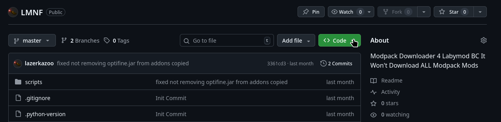
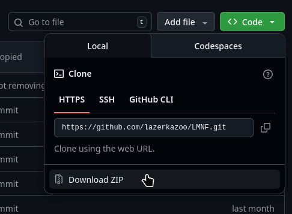

# How to Download
- on the github page go to the "Code" drop down and press "Download ZIP"
 
- extract, then open in the directory command prompt
# Requirements
- python
- requests (python)
## How to install requests
- make sure python is installed by running `python --version` (in command prompt), if it looks something like `Python 3.13` u r good
- run `pip install requests` (also in command prompt)
# How to Run
- run `python main.py` in the directory with the "main.py" file (also also in command prompt)
# Example of How to Use
- the .mrpack files will be from your **Downloads** folder
- it will say something like this:
```
(1) Fabulously.Optimized-v12.0.0-beta.5.mrpack
(2) CobbleMonOfficial.mrpack
choose -> 
```
- in this example u must choose between fabulously optimized and cobblemon official
- if u choose 1 (by typing 1 then pressing enter) it will download fabulously optimized ***but*** if u choose 2 it will download cobblemon official
# If This Does not Work
- plz tell me so that i can fix it
- i haven't tested it on windows very much
